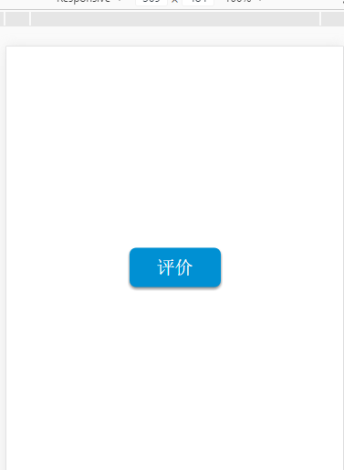
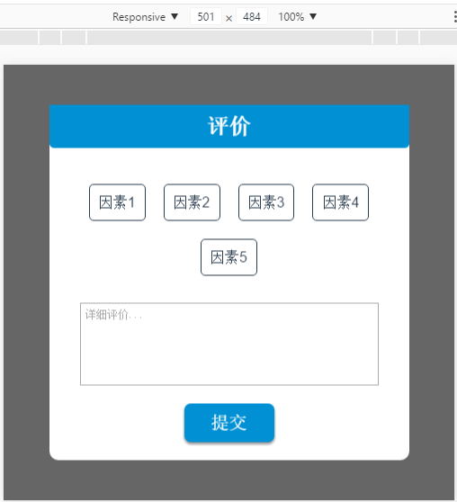

## 本项目为VUe单文件组件开发,此组件为常用评价组件.
---

### v2.0 *2017/09/02 22:30*
```
1. 效果整体优化

2. 修改为3d效果,配合旋转渐隐渐现

3.一些小细节效果改善

```
<div>
<iframe src="src/img/v2.0-1.gif" style="width:530px;height:560px" frameborder=0 >
</div>

---

### v1.1 *2017/09/02 21:10*
```
1. 增加唤起按钮

2. 评价框增加悬浮效果,部分效果优化

```
<figure style="display:flex">


</figure>

---

### v1.0 *雏形阶段 2017/09/02*

```
1. 本项目意在练习VUe单文件组件开发

2. 纤维雏形阶段,实现基本界面与评价因素借接口
```


---

### commment-vue

> A Vue.js project

### Build Setup

``` bash
# install dependencies
npm install

# serve with hot reload at localhost:8080
npm run dev

# build for production with minification
npm run build

# build for production and view the bundle analyzer report
npm run build --report

# run unit tests
npm run unit

# run e2e tests
npm run e2e

# run all tests
npm test
```

For detailed explanation on how things work, checkout the [guide](http://vuejs-templates.github.io/webpack/) and [docs for vue-loader](http://vuejs.github.io/vue-loader).
