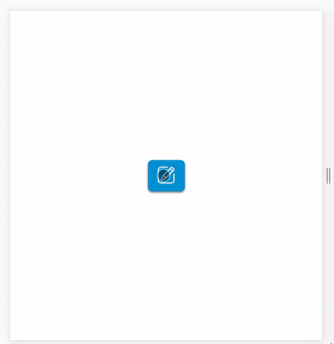
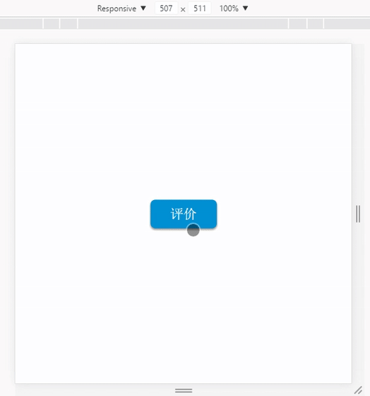

## 本项目为Vue单文件组件开发,此组件为常用评价组件.
[http://league.xhuyq.me/vue-comment](http://league.xhuyq.me/vue-comment)

### v3.4 *2017/09/14*
```
1. 部分适配移动端
2. color调整，看着更舒服
```

### v3.3 *2017/09/11*
```
1. 布局调整，去掉fixed，适配组件布局
```

### v3.2 *2017/09/9*
```
1. 评价信息绑定，保留当前评价记录
```
### v3.1 *2017/09/07*
```
1. stars渲染条件优化 ,减少无用渲染
```
### v3.0 *2017/09/05*
```
1. icon全面替换,蓝色系主题

2. 增加评价star数动态渲染

  2.1 第一排star:由评价因素数决定,5颗星按百分比渲染
  
  2.2 第二排star:正常模式,手动选择星级
```


---

### v2.0 *2017/09/02 22:50*
```
1. 整体效果优化

2. 修改为3d效果,配合渐隐渐现的旋转效果

3.一些小细节效果改善
```


---

### v1.1 *2017/09/02 21:10*
```
1. 增加唤起按钮

2. 评价框增加悬浮效果,部分效果优化
```
<div style="display:flex">


</div>

---

### v1.0 *雏形阶段 2017/09/02*

```
1. 本项目意在练习VUe单文件组件开发

2. 纤维雏形阶段,实现基本界面与评价因素接口
```


---

### commment-vue

> A Vue.js project

### Build Setup

``` bash
# install dependencies
npm install

# serve with hot reload at localhost:8080
npm run dev

# build for production with minification
npm run build

# build for production and view the bundle analyzer report
npm run build --report

# run unit tests
npm run unit

# run e2e tests
npm run e2e

# run all tests
npm test
```

For detailed explanation on how things work, checkout the [guide](http://vuejs-templates.github.io/webpack/) and [docs for vue-loader](http://vuejs.github.io/vue-loader).
